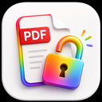

<h1>
  
  PDF Unlocker
</h1>

한국어 | [English](README.md)

PDF Unlocker는 사용 권한이 있는 PDF의 암호화 제한을 로컬에서 해제하는 macOS 앱입니다. Finder에서 PDF를 드래그 앤 드롭하거나 앱 안에서 파일을 선택하면, 원본 파일 옆에 `{파일명}-unlock.pdf` 형식으로 새 PDF를 저장합니다.

PDF Unlocker는 SwiftUI로 만든 작은 데스크톱 앱이며, PDF 처리에는 검증된 오픈소스 도구인 [`qpdf`](https://qpdf.sourceforge.io/)를 사용합니다. 알 수 없는 비밀번호를 복구하거나 크래킹하지 않습니다. PDF 열기 비밀번호가 필요한 파일은 사용자가 알고 있는 비밀번호를 입력해야 처리할 수 있습니다.

## 주요 기능

| 기능 | 설명 |
| --- | --- |
| 드래그 앤 드롭 | Finder에서 PDF 파일 하나 또는 여러 개를 앱으로 끌어다 놓을 수 있습니다. |
| 파일 선택 | `Command-O` 또는 `Choose PDF` 버튼으로 PDF를 선택할 수 있습니다. |
| 예측 가능한 저장명 | 원본 옆에 `{파일명}-unlock.pdf`로 저장합니다. 기존 파일이 있으면 `-unlock-2`, `-unlock-3`처럼 덮어쓰지 않습니다. |
| 알려진 비밀번호 입력 | 열기 비밀번호가 있는 PDF에 대해 사용자가 알고 있는 비밀번호를 입력할 수 있습니다. |
| 명확한 오류 안내 | 비밀번호가 필요한 경우와 비밀번호가 틀린 경우를 구분해 안내합니다. |
| 로컬 처리 | PDF를 외부 서버로 업로드하지 않습니다. |

## 요구 사항

- macOS 13 Ventura 이상
- Homebrew
- qpdf

qpdf 설치:

```bash
brew install qpdf
```

## 설치

최신 릴리스에서 `PDFUnlocker.dmg`를 다운로드한 뒤 열고, **PDF Unlocker.app**을 **Applications** 폴더로 옮기면 됩니다. 현재 릴리스는 `v0.1.3`입니다.

macOS에서 확인되지 않은 개발자 경고가 표시되면 Finder에서 앱을 우클릭한 뒤 **열기**를 선택해 한 번만 승인하면 됩니다. 현재 배포 빌드는 직접 배포 테스트를 위한 ad-hoc 서명 앱입니다.

## 사용 방법

1. **PDF Unlocker**를 실행합니다.
2. 상단에 `qpdf ready`가 표시되는지 확인합니다.
3. 필요한 경우 PDF 열기 비밀번호를 입력합니다.
4. PDF를 드롭 영역에 끌어다 놓거나 **Choose PDF**를 클릭합니다.
5. 원본 파일과 같은 폴더에서 해제된 PDF를 확인합니다.

예시:

```text
lecture1_intro.pdf -> lecture1_intro-unlock.pdf
```

## 가능한 작업과 불가능한 작업

PDF Unlocker는 qpdf가 합법적으로 변환할 수 있는 PDF의 암호화 제한을 제거할 수 있습니다. 예를 들어 PDF는 열리지만 복사, 인쇄, 편집이 제한된 경우에 사용할 수 있습니다. 열기 비밀번호가 걸린 PDF는 올바른 비밀번호를 알고 있어야 합니다.

PDF Unlocker는 비밀번호 복구 도구가 아닙니다. 알 수 없는 비밀번호가 필요한 PDF는 비밀번호가 필요하다는 점을 명확히 안내하고, 비밀번호 추측이나 우회는 시도하지 않습니다.

## 소스에서 빌드

```bash
git clone https://github.com/eidenchoe-appstore/pdf-unlocker.git
cd pdf-unlocker
brew install qpdf
swift test
./script/build_and_run.sh --verify
./script/package_dmg.sh
```

패키징된 앱과 DMG는 `dist/`에 생성됩니다.

## 개발 메모

- 앱 소스: `Sources/PDFUnlocker`
- qpdf 처리 및 파일명 규칙: `Sources/PDFUnlockerCore`
- 앱 아이콘 원본: `icon.icon`
- README 아이콘: `Resources/READMEIcon.png`
- 테스트: `Tests/PDFUnlockerCoreTests`
- 로컬 실행 스크립트: `script/build_and_run.sh`
- DMG 패키징 스크립트: `script/package_dmg.sh`

앱은 `/opt/homebrew/bin/qpdf`, `/usr/local/bin/qpdf`, Homebrew sbin 경로, 그리고 현재 `PATH`에서 `qpdf`를 찾습니다.

## 라이선스

MIT. 자세한 내용은 `LICENSE`를 확인하세요.
